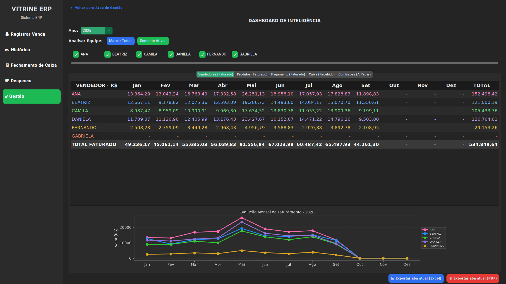
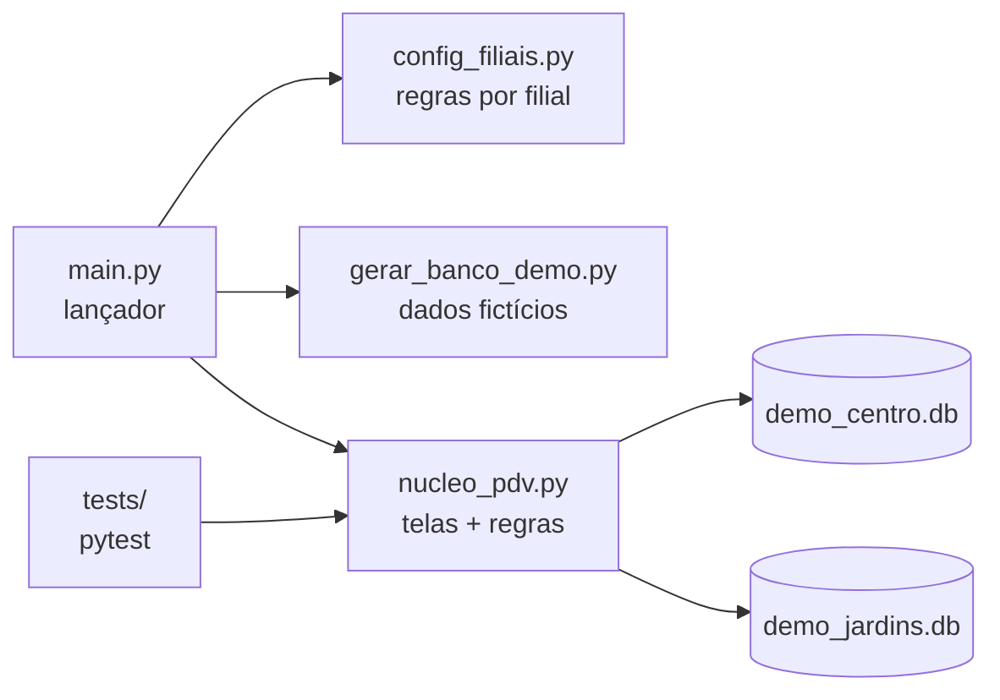
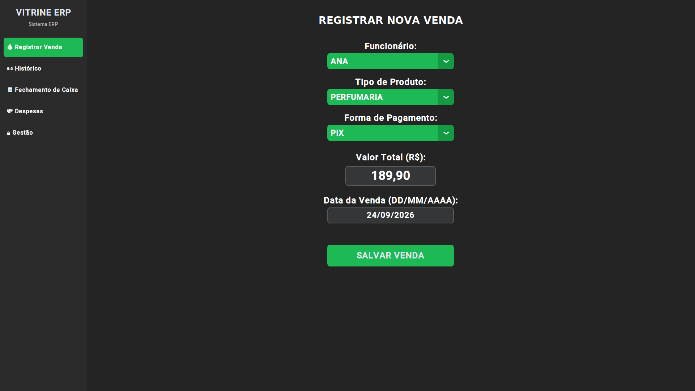
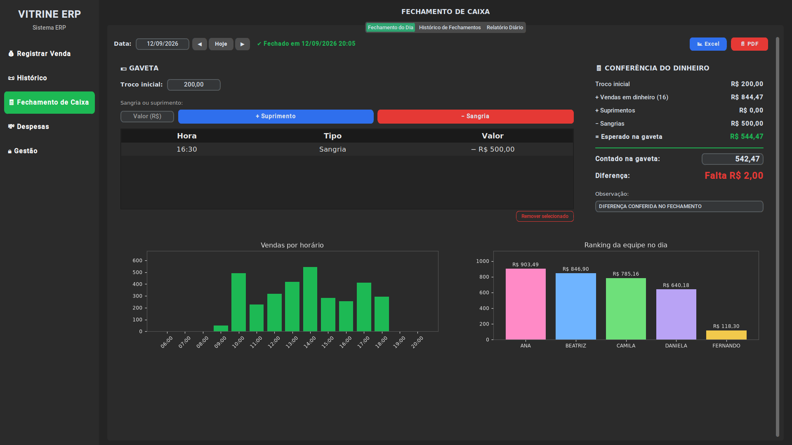
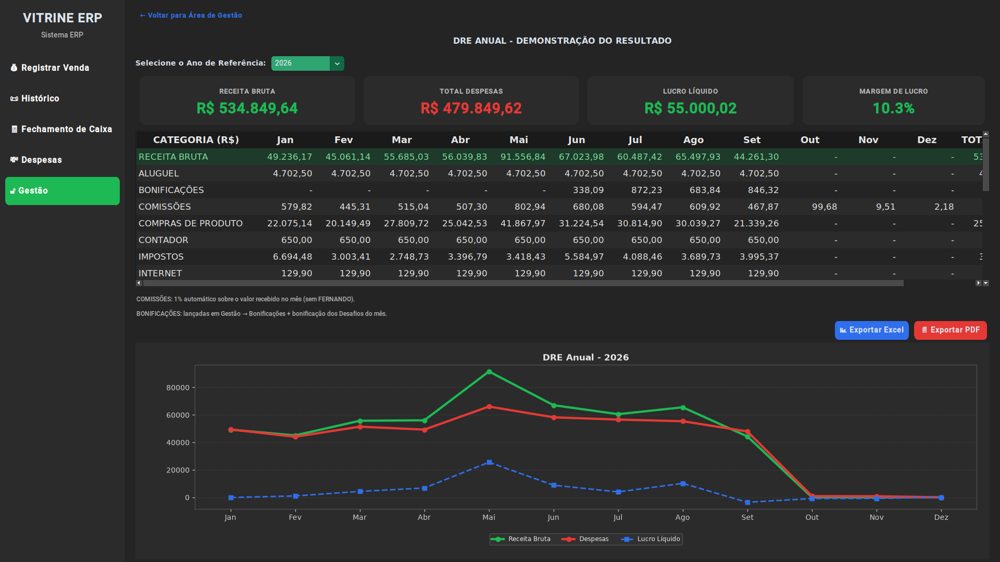
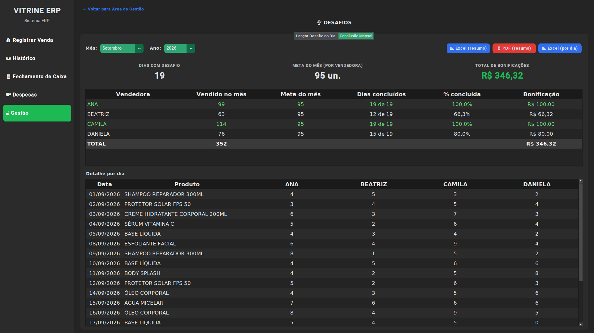
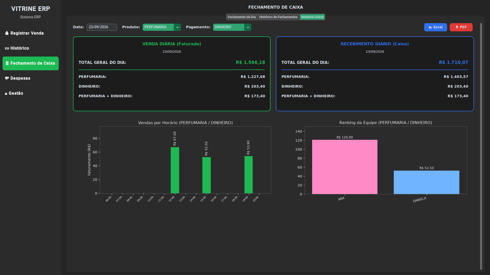
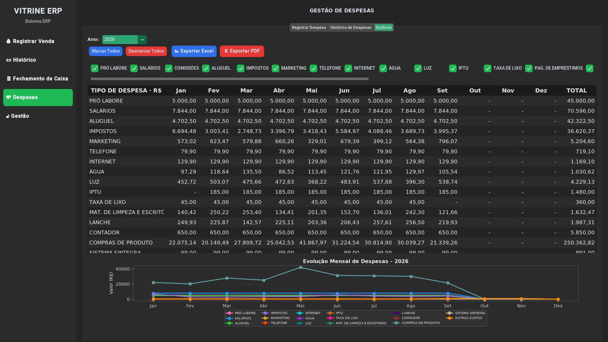

# Vitrine ERP

**PDV/ERP desktop para varejo multiloja: vendas, fechamento de caixa, despesas, comissões, metas da equipe e DRE, em Python e SQLite.**

*Desktop point-of-sale and back-office ERP for multi-store retail: sales, cash closing, expenses, commissions, team goals and P&L, built with Python and SQLite.*




> **Dados fictícios.** Esta é a versão pública de um sistema em uso real numa rede de cosméticos com duas filiais. Nome da loja, equipe, senha e todos os números foram trocados por dados gerados por `gerar_banco_demo.py`. Nenhuma informação do cliente está neste repositório.
>
> *Fictional data. This is the public version of a system running in production at a two-store cosmetics retailer. Store name, staff, password and every number were replaced with data generated by `gerar_banco_demo.py`. No client information is in this repository.*

[🇧🇷 Português](#-português) · [🇺🇸 English](#-english)

---

## 🇧🇷 Português

### O problema

A loja controlava vendas, comissões, despesas e caixa em planilhas e cadernos, com duas filiais e equipes diferentes. Fechar o mês levava horas, a comissão era calculada à mão, e ninguém sabia o lucro real de cada mês.

### A solução

Um sistema desktop que roda offline em cada filial, gera um executável Windows (sem instalar Python) e registra cada venda em segundos. Com esses dados, monta sozinho o fechamento de caixa, as comissões, as metas da equipe e o DRE.

Na versão real, o sistema já registrou **mais de 180 mil lançamentos de venda**. Esta demo abre com **cerca de 65 mil lançamentos fictícios**, de janeiro de 2024 até hoje, com sazonalidade realista.

### Funcionalidades

| Área | O que faz |
|---|---|
| **Registrar venda** | Vendedora, categoria, forma de pagamento e valor. Crédito parcelado gera as parcelas com vencimento de 30/60/90 dias e centavos exatos. |
| **Histórico** | Busca por vendedora e data, edição, exclusão e exportação para Excel/PDF. |
| **Fechamento de caixa** | Troco inicial, sangrias e suprimentos, valor contado e diferença (Falta/Sobra/OK). Tem histórico mensal e Relatório Diário (faturado × recebido por forma de pagamento). |
| **Despesas** | Lançamento à vista ou parcelado, histórico e gráficos por categoria. |
| **Dashboard** | Faturamento mensal por vendedora, categoria e forma de pagamento; caixa recebido; comissões a pagar. |
| **Desafio do Dia** | Um produto por dia, meta de 5 unidades por vendedora e bonificação mensal proporcional (teto de R$ 100). |
| **Bonificações** | Bonificações da gerência separadas da comissão. |
| **DRE anual** | Receita, despesas por categoria, comissão automática (1% do recebido), bonificações, lucro e margem. |
| **Área de Gestão** | Protegida por senha (hash PBKDF2), com bloqueio automático após 5 minutos sem uso. |
| **Multiloja** | O mesmo motor atende N filiais; cada uma tem o seu banco e as suas regras em `config_filiais.py`. |

### Regras de negócio que valem destacar

- **Comissão pelo regime de caixa:** 1% entra no mês em que o dinheiro é recebido (a venda parcelada gera comissão em cada parcela), igual no Dashboard e no DRE.
- **Desafio mensal com compensação:** vender 3 num dia e 7 no outro conta como 2 dias concluídos. A bonificação é R$ 100 × % atingida, com teto.
- **Valores no padrão brasileiro:** "1.500" é lido como mil e quinhentos, não 1,5. Isso corrige um erro real que existia no sistema anterior.
- **Nomes normalizados na leitura:** variações digitadas errado ("ANA-PAULA", "ANA'") são agrupadas nos relatórios sem alterar o histórico.
- **Transações atômicas:** fechamento de caixa e resultados do desafio são gravados por inteiro ou não são gravados.

### Arquitetura



- **SQLite em modo WAL**, com uma conexão única e índices nas colunas de data e vendedora.
- **Erros tratados na interface:** nenhuma exceção fecha o programa. Tudo vai para `erros_sistema.log` e o usuário vê um aviso amigável.
- **Migração sem dor:** tabelas novas com `CREATE TABLE IF NOT EXISTS`, então um banco antigo abre na versão nova sem script de migração.
- **Design system próprio:** cores, fontes e raios centralizados na classe `Tema`, e tema escuro aplicado também a tabelas e gráficos. Veja [docs/DESIGN_SYSTEM.md](docs/DESIGN_SYSTEM.md).

### Como rodar

```bash
git clone https://github.com/alissonlittig/vitrine-erp.git
cd vitrine-erp
python -m venv venv
venv\Scripts\activate          # Windows  (Linux/Mac: source venv/bin/activate)
pip install -r requirements.txt
python main.py
```

Na primeira execução o banco fictício é criado sozinho. **Senha da Área de Gestão: `demo123`**

Outros comandos:

```bash
python main.py --filial jardins     # abre direto uma filial
python main.py --regerar-demo       # recria os dados fictícios
pip install -r requirements-dev.txt
pytest -q                           # testes das regras de negócio
pyinstaller --clean vitrine_erp.spec  # gera dist/VitrineERP/VitrineERP.exe
```

### Estrutura

```
vitrine-erp/
├── main.py               # lançador (escolha de filial, banco demo automático)
├── config_filiais.py     # filiais, equipe, regras de comissão/desafio, hash da senha
├── nucleo_pdv.py         # motor: telas, banco de dados e regras de negócio
├── gerar_banco_demo.py   # gerador de dados fictícios realistas (semente fixa)
├── tests/                # pytest: valores, desafio, senha, integridade do banco
├── docs/                 # design system e capturas de tela
└── vitrine_erp.spec      # build do executável Windows (PyInstaller)
```

### Próximos passos

- Separar `nucleo_pdv.py` em camadas (telas / regras / repositório).
- Valores em centavos inteiros e datas em ISO no banco.
- Relatório consolidado das filiais e backup automático para a nuvem.

---

## 🇺🇸 English

### The problem

A two-store cosmetics retailer tracked sales, commissions, expenses and cash in spreadsheets and notebooks. Month-end took hours, commissions were computed by hand, and nobody knew the real monthly profit.

### The solution

An offline desktop system, shipped as a Windows executable, that records each sale in seconds and turns that data into cash closing, commissions, team goals and a P&L. In production it has recorded **180k+ sale entries**. This demo ships with about **65k fictional entries** with realistic seasonality.

### Features

- **Sales & history:** installment credit sales with exact-cent split and 30/60/90-day due dates; search, edit, Excel/PDF export.
- **Cash closing:** opening float, cash drops and top-ups, counted vs. expected (short/over/OK), monthly history and a daily billed vs. received report.
- **Expenses:** one-off or installment expenses, charts by category.
- **Dashboard:** monthly revenue by salesperson, category and payment method; cash received; commissions payable.
- **Daily Challenge:** one product per day, 5 units per salesperson, pro-rata monthly bonus capped at R$ 100.
- **P&L:** revenue, expenses by category, automatic 1% commission (cash basis), bonuses, profit and margin.
- **Management area:** PBKDF2-hashed password and auto-lock after 5 idle minutes.
- **Multi-store:** one engine, N stores, each with its own database and rules.

### Tech highlights

Python 3.12 · CustomTkinter · SQLite (WAL) · Matplotlib · OpenPyXL · ReportLab · PyInstaller · pytest.
The UI never crashes on errors: exceptions are logged and shown as friendly messages. Schema changes are additive (`CREATE TABLE IF NOT EXISTS`). A single `Tema` class holds all design tokens ([docs/DESIGN_SYSTEM.md](docs/DESIGN_SYSTEM.md)).

### Run it

```bash
pip install -r requirements.txt
python main.py        # management password: demo123
pytest -q             # business-rule tests
```

---

## Telas · Screenshots

| | |
|---|---|
|  |  |
| Registrar venda · *Sale entry* | Fechamento de caixa · *Cash closing* |
|  |  |
| DRE anual · *Annual P&L* | Desafio do Dia · *Daily Challenge* |
|  |  |
| Relatório diário · *Daily report* | Despesas · *Expenses* |

## Autor · Author

**Alisson De Littig**: [LinkedIn](https://www.linkedin.com/in/Alisson-Littig) · [GitHub](https://github.com/alissonlittig)

Licença MIT · *MIT License*
